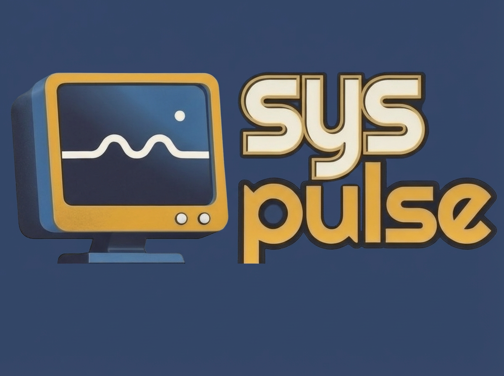

# Syspulse

**One daemon manager. Every platform.**

Syspulse is a lightweight, cross-platform daemon manager that gives developers and DevOps engineers a unified way to control long-running processes across Windows, macOS, and Linux. Define your services in a single `.sys` file, manage them with consistent commands, and stop wrestling with platform-specific quirks.

---

## Why Syspulse?

Managing services across operating systems means juggling `systemd`, `launchd`, Windows Services, and a dozen edge cases. Syspulse replaces all of that with a single, consistent interface.

| Capability | What You Get |
|---|---|
| **Cross-platform consistency** | Same config, same commands — Windows, macOS, Linux |
| **Health monitoring** | Built-in HTTP, TCP, and command-based health checks |
| **Smart restarts** | Automatic recovery with exponential backoff |
| **Log rotation** | Configurable retention with compression support |
| **Scheduled jobs** | Cron-style scheduling without external dependencies |
| **Resource limits** | Memory and CPU caps to prevent runaway processes |

For a deeper comparison with alternatives, see the [Decision Guide →](docs/WHY.md)

---

## Quick Start

### Install

```bash
cargo install syspulse
```

### Configure

Create a `.sys` file to define your daemons:

```toml
# mydaemons.sys
[[daemon]]
name = "web-server"
command = ["python", "-m", "http.server", "8000"]
description = "Simple HTTP server"
```

### Run

```bash
syspulse daemon &                # Start the daemon manager
syspulse add --file mydaemons.sys  # Register your daemons
syspulse start web-server          # Launch a service
syspulse status                    # View all daemon states
```

For the full walkthrough, see the [Quick Start Guide →](docs/QUICKSTART.md)

---

## Features

**Process Lifecycle** — Start, stop, and restart daemons with graceful shutdown and signal handling.

**Health Monitoring** — Continuous HTTP, TCP, or command-based health checks with automatic recovery on failure.

**Restart Policies** — Configurable strategies including exponential backoff, max retry limits, and cooldown periods.

**Log Rotation** — Automatic log file rotation with size thresholds, retention limits, and optional compression.

**Scheduling** — Cron-style job scheduling for periodic tasks, no external scheduler required.

**Resource Limits** — Set memory and CPU usage caps to prevent any single process from starving the system.

**JSON API** — Machine-parseable output for every command, making Syspulse easy to integrate into CI/CD pipelines and monitoring tools.

**Tagging** — Group and filter daemons by tags for streamlined bulk operations.

---

## Documentation

| Resource | Description |
|---|---|
| [Quick Start Guide](docs/QUICKSTART.md) | Step-by-step tutorial to get running in minutes |
| [Configuration Reference](docs/CONFIG.md) | Complete `.sys` file options and examples |
| [CLI Reference](docs/CLI.md) | Every command, flag, and option |
| [Why Syspulse?](docs/WHY.md) | Comparison with alternatives and decision guide |

---

## Examples

The [`examples/`](examples/) directory contains ready-to-use configurations:

- Simple single-daemon setups
- Multi-daemon configurations with health checks and restart policies
- Platform-specific examples for Windows, macOS, and Linux
- Scheduled job configurations

---

## Architecture

Syspulse is built with Rust (2021 edition) and organized as a Cargo workspace with three crates:

```
syspulse/
├── crates/
│   ├── syspulse-core/   # Core daemon management logic
│   ├── syspulse/    # Command-line interface
│   └── syspulse-py/     # Python bindings (PyO3)
├── examples/            # Sample configurations
└── docs/                # Documentation
```

### `syspulse-core`

The engine. Handles process lifecycle, health monitoring, configuration parsing, and IPC.

```
syspulse-core/src/
├── lib.rs              # Crate root, re-exports public API
├── manager.rs          # High-level daemon manager
├── config.rs           # TOML .sys file parsing
├── process/
│   ├── unix.rs         # Unix process handling
│   └── windows.rs      # Windows process handling
├── health/
│   ├── http.rs         # HTTP health checks
│   ├── tcp.rs          # TCP health checks
│   └── command.rs      # Exec-based health checks
├── ipc/
│   └── protocol.rs     # IPC message definitions
└── utils.rs            # Shared helpers
```

Platform modules expose a unified `ProcessHandler` trait — each file implements the OS-specific version. Health checks share a common trait with one module per check type. Public API is re-exported from `lib.rs` to keep the crate surface small.

### `syspulse`

The interface. Translates user commands into IPC calls against the running daemon manager.

```
syspulse/src/
├── main.rs             # Entry point, async runtime setup
├── commands/
│   ├── start.rs        # syspulse start
│   ├── stop.rs         # syspulse stop
│   ├── restart.rs      # syspulse restart
│   ├── status.rs       # syspulse status
│   ├── add.rs          # syspulse add
│   ├── remove.rs       # syspulse remove
│   ├── init.rs         # syspulse init
│   ├── list.rs         # syspulse list
│   ├── logs.rs         # syspulse logs
│   └── mod.rs          # Command registry
├── client.rs           # IPC client
└── output.rs           # Plain text / JSON formatting
```

Commands use `clap` derive macros for argument parsing. All command functions are `pub async fn run(...) -> Result<()>`. Output format (plain text or JSON) is toggled via the `--json` flag.

### `syspulse-py`

Python bindings powered by PyO3 and built with Maturin, exposing core functionality to Python consumers.

### Conventions

The codebase follows a consistent set of patterns across all crates:

- **Error handling** — `thiserror` for typed errors, `anyhow` for context propagation. No `unwrap()` or `expect()` in production code.
- **Async runtime** — Tokio with full features. No mixing of sync and async I/O in the same function.
- **Testing** — Inline test modules only (`#[cfg(test)] mod tests` in source files), no separate `tests/` directory.
- **Linting** — All code passes `cargo clippy` without warnings and is formatted with `rustfmt`.
- **State storage** — SQLite via `rusqlite` for daemon state persistence.

---

## Development

### Build from source

```bash
cargo build --release
```

### Run tests

```bash
cargo test
```

### Python bindings

> **Note:** PyO3 0.24 does not yet support Python 3.14.

```powershell
# Default build
./scripts/build-python.ps1

# Build the full workspace using the venv interpreter
./scripts/build-python.ps1 -Workspace

# Target a specific Python version
./scripts/build-python.ps1 -PythonVersion 3.11 -VenvPath .venv311
```

---

## License
www.cyberboost.com/license for more information 